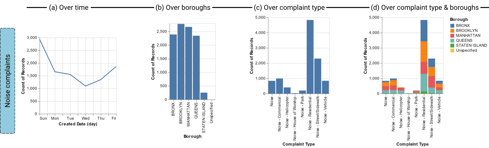
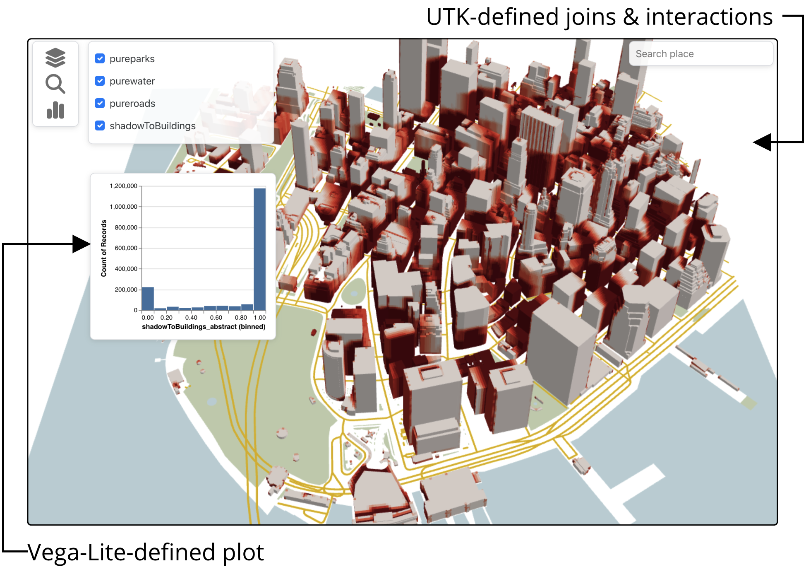

# A Tutorial on High-level Grammars for Visualization and Visual Analytics

This repository contains the material for the SIBGRAPI 2023 tutorial on high-level grammars for visualization and visual analytics. A detailed description of the tutorial can be found in our [paper](grammars.pdf).

- Gustavo Moreira, [@gmorei3](https://twitter.com/gmorei3), UIC
- [Marcos Lage](http://www.ic.uff.br/~mlage/), [@_mlage](https://twitter.com/_mlage), UFF
- [Nivan Ferreira](https://www.cin.ufpe.br/~nivan/), [@NIvanFerreira](https://twitter.com/NIvanFerreira), UFPE
- [Fabio Miranda](https://fmiranda.me), [@fabiom_miranda](https://twitter.com/fabiom_miranda/), UIC

## Part 1: An overview of grammars for visualization

The first part of the tutorial presents an overview of the foundations of grammars of graphics, and how it substantiates the many developments in the visualization field.

Slides: [intro.pdf](00-intro/intro.pdf)

## Part 2: The Vega-Lite grammar

The second part of the tutorial presents an overview of the subsequent works on grammars for authoring visualizations, with a more in-depth (and practical) look at [Vega-Lite](https://vega.github.io/vega-lite/), given its widespread adoption across visualization systems. 

Slides: [vega.pdf](01-vega/vega.pdf)  
Examples: [01-vega](01-vega/)

## Part 3: The Urban Toolkit

The third part of the tutorial presents our perspectives on the design of a domain-specific grammar used by [the Urban Toolkit](http://urbantk.org).

Slides: [utk.pdf](02-utk/utk.pdf)  
Examples: [02-utk](02-utk/)

UTK was first presented in the [IEEE VIS 2023 paper](https://arxiv.org/abs/2308.07769):  
**The Urban Toolkit: A Grammar-based Framework for Urban Visual Analytics**  
Gustavo Moreira, Maryam Hosseini, Md Nafiul Alam Nipu, Marcos Lage, Nivan Ferreira, Fabio Miranda  
IEEE Transactions on Visualization and Computer Graphics (Proceedings of IEEE VIS 2023 -- Accepted, to appear)
